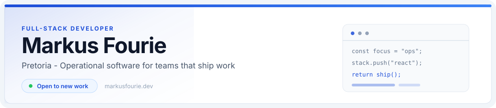

  

  I build operational software for <strong>Katanga Contracting Services</strong> and related work. 
  <a href="https://markusfourie.dev">markusfourie.dev</a>
  ·
  Open to new work and new experiences.

  

##  Now

Full time with Katanga Contracting Services / Rimitso Management Services.

Degree finished: **BSc Computer and Information Sciences**, Varsity College (now Emeris), Pretoria, final year 2025. Top Achiever 2025. [Golden Key](https://golden-key-international-honou.verified.cv/en/verify/20892159851455) Top Performer, 23 April 2025.

  

##  Selected work

### [Resource Management System](https://rms.rimitso.com)

Operations system for Katanga Contracting Services on Azure. Sites, assets, teams, and shift transactions, with approval before they reach reports. 388 assets, 46 system users.

`React` · `ASP.NET Core` · `Entity Framework` · `Postgres`

### Afrisist

Alarm monitoring dashboard for vehicle fleets on Azure. Operators watch incoming alarms, assign them, and get notified as events arrive. Built while I was there. I am not full-time there now.

### [Eridge RDA](https://www.eridgerda.org.uk)

Site and CMS for the Eridge group of Riding for the Disabled. Programmes, a photo gallery, volunteer applications, and a protected admin.

`React` · `Vite` · `Supabase`

### [Skillance](https://skillance.co.za)

Verified freelance marketplace for South Africa, co-built 50/50 with [Kyle Nel](https://www.linkedin.com/in/kyle-nel-026742193/). Discover a professional, review the profile, and book with payment held until the work is approved. Coming soon on iOS and Android.

  

##  Stack

Web first: HTML, CSS, JavaScript, TypeScript, React, Tailwind, Node.js, SQL / Postgres, then C#, ASP.NET Core, and Entity Framework.

Cloud and network: Linux, Docker, Nginx, GitHub Actions, Azure, Cloudflare tunnels.

Home lab: HP Victus 14 running Plex and local Ollama models (Gemma, Qwen).

  
  
  
  
  
  
  
  
  

  

##  Contact

- Site: [markusfourie.dev](https://markusfourie.dev)
- Email: [markusfourie@icloud.com](mailto:markusfourie@icloud.com)
- LinkedIn: [markus-fourie](https://www.linkedin.com/in/markus-fourie/)
